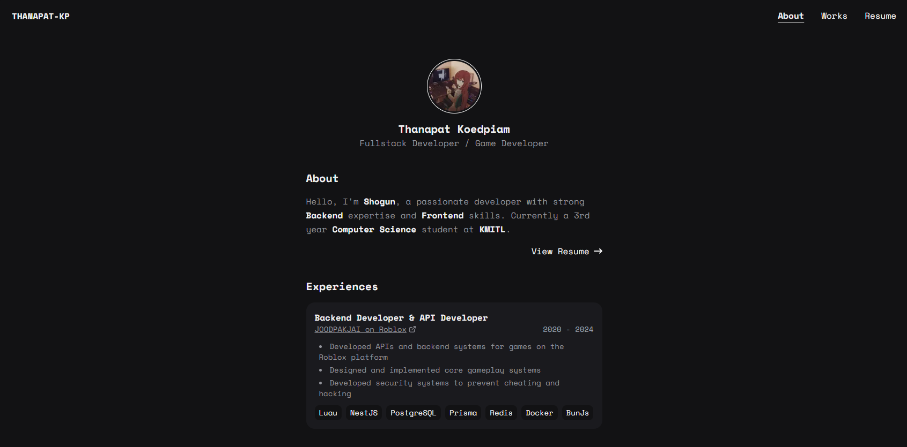

# 🌟 Thanapat Koedpiam Web

<div align="center">
  


**A modern, responsive personal portfolio website**

[✨ Features](#-features) •
[🛠️ Tech Stack](#️-tech-stack) •
[🏁 Getting Started](#-getting-started) •
[📚 Project Structure](#-project-structure) •
[🚀 Deployment](#-deployment)

</div>

---

## ✨ Features



- **📱 Responsive Design** - Looks great on all devices
- **👤 About Section** - Personal bio and introduction
- **🛠️ Skills Showcase** - Technical abilities and expertise
- **💼 Work Experience** - Professional history timeline
- **🏆 Project Gallery** - Showcase of completed projects
- **📄 Resume View** - Professional summary and experience
- **⚡ Fast Performance** - Optimized for speed and SEO

<br clear="right"/>

## 🛠️ Tech Stack

<table>
  <tr>
    <td align="center" width="96">
      
      <br>Next.js 15
    </td>
    <td align="center" width="96">
      
      <br>React 19
    </td>
    <td align="center" width="96">
      
      <br>TypeScript
    </td>
    <td align="center" width="96">
      
      <br>Tailwind 4
    </td>
    <td align="center" width="96">
      
      <br>Vercel
    </td>
  </tr>
</table>

## 🏁 Getting Started

### Prerequisites

- Node.js 18 or higher
- npm, yarn, or bun package manager

### Installation

1. Clone the repository

```bash
git clone https://github.com/yourusername/thanapat-kp-web.git
cd thanapat-kp-web
```

2. Install dependencies

```bash
npm install
# or
yarn install
# or
bun install
```

3. Start the development server

```bash
npm run dev
# or
yarn dev
# or
bun dev
```

4. Open [http://localhost:3000](http://localhost:3000) with your browser to see the result.

## 📚 Project Structure

```
thanapat-kp-web/
├── public/          # Static assets
├── src/
│   ├── app/         # Next.js pages and routes
│   ├── components/  # Reusable UI components
│   └── data/        # Content data files
│       ├── about.ts         # Personal information
│       ├── skills.ts        # Technical skills
│       ├── works.ts         # Portfolio projects
│       └── experiences.ts   # Work experience
└── package.json     # Project dependencies
```

## 🎨 Customization

You can easily customize the content by modifying the data files in the `src/data` directory:

| File             | Description                                                        |
| ---------------- | ------------------------------------------------------------------ |
| `about.ts`       | Edit your personal information, bio, and contact details           |
| `skills.ts`      | Update your technical skills, tools, and proficiency levels        |
| `works.ts`       | Add or modify your portfolio projects with descriptions and images |
| `experiences.ts` | Update your work history, roles, and achievements                  |

## 📦 Dependencies

- **Developer Icons**: Tech stack and programming language icons
- **React Icons**: UI icons for enhanced visual experience
- **Tailwind CSS**: Utility-first CSS framework for styling

## 🚀 Deployment

The easiest way to deploy your portfolio is to use the [Vercel Platform](https://vercel.com/new).

1. Push your code to a GitHub repository
2. Import your project to Vercel
3. Vercel will detect Next.js and set up the build configuration automatically
4. Your site will be deployed to a global CDN with HTTPS

For more deployment options, check out the [Next.js deployment documentation](https://nextjs.org/docs/app/building-your-application/deploying).

---

<div align="center">
  
Made with ❤️ by jumpogpo

</div>
